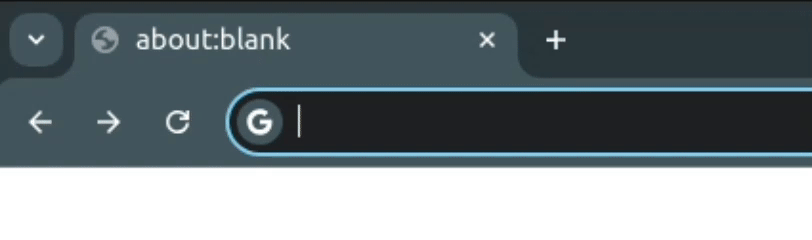
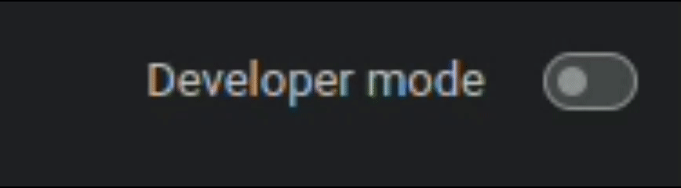
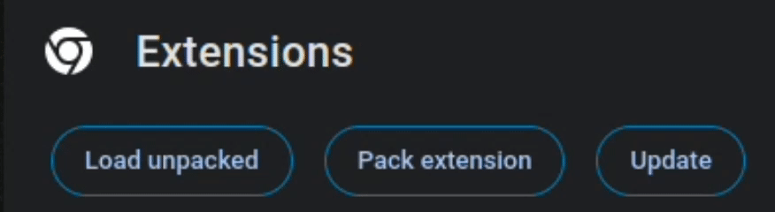
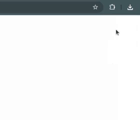
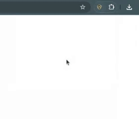
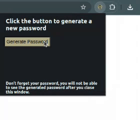
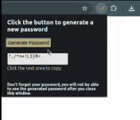

# Safe Password Generator 🔐 🛡️

### Chrome Extension 🌐

##

Generate secure passwords with a mix of uppercase letters, lowercase letters, numbers, and symbols, ensuring no characters repeat. 🔢🔤💡

##

### Installation Instructions 🛠️

1. **Download the Zip File** 📥

   - Download the extension package from the "Code" menu as a `.zip` file, or clone the repository using Git.

2. **Open Chrome Extensions** 🧩

   - Enter `chrome://extensions` in your Chrome browser's address bar and press Enter.

   

3. **Enable Developer Mode** ⚙️

   - Toggle "Developer Mode" on. You'll find this option in the top right corner of the extensions page.

   

4. **Load the Extension** 📂

   - Click "Load unpacked" and select the directory where you extracted the `.zip` file to install the extension.

   

##

### Using the Safe Password Generator Chrome Extension 🛡️

Follow these steps to generate and securely manage your passwords:

##

1. **Click the Extension Icon** 🛡️

   - Locate the extension icon in your Chrome browser's toolbar and click on it.

   

##

2. **Open the Password Generator** 🛠️

   - A popup window will appear. Look for a button labeled "Generate Password" and click on it.

   

##

3. **Generate a Password** 🔑

   - After clicking the "Generate Password" button, a strong and secure password will be displayed in a text box within the popup window.

   

##

4. **Copy Your Password** 📋

   - To copy the generated password, simply click on the text box displaying the password. The password will be automatically copied to your clipboard.

   

##

5. **Repeat as Needed**
   - You can generate new passwords by clicking the "Generate Password" button as many times as you like.

##

### ⚠️ **Important Note** ⚠️

Please remember to save or securely store your generated password. Once you close the popup window, you will not be able to view the password again.

##

## Development 🖥️

- UI : **HTML & CSS**
- Logic : **JavaScript**
- Visuals : **Photoshop, Capcut**
- Other : **JSON, MD**

### Password Generation Algorithm

1. **Define Character Sets**

   - Lowercase: `abcdefghijklmnopqrstuvwxyz`
   - Uppercase: `ABCDEFGHIJKLMNOPQRSTUVWXYZ`
   - Symbols: ` !@#$%^&*()_+~\``|}{[]:;?><,./-= `
   - Numbers: `0123456789`

2. **Determine Quantities**

   - Generate random numbers for each set so their sum equals the password length (12 characters).

3. **Select Random Characters**

   - Pick characters from each set based on the quantities determined in Step 2, ensuring no repetition.

4. **Combine and Shuffle**

   - Combine selected characters and shuffle them using the Fisher-Yates algorithm.

5. **Final Password**
   - The shuffled string is the finalized password.

##

### License 📜

This project is licensed under the MIT License - see the LICENSE file for details.
